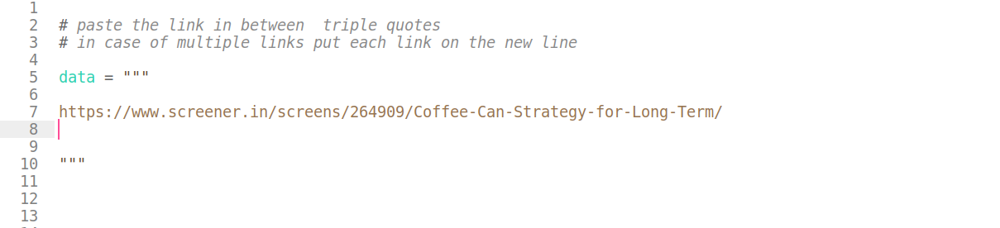

# screener-scraper
python script to scrape the screener.in website


installation 

```python

pip3 install requirements.txt

```
usage:

- Open scraper.py file and put the links in between the triple quotes which is multiline string assigned to data varaiable. .e.g.



- save file and open terminal and run command 

```python3

python3 scraper.py

```

script will scrape the data and save .xlsx file in the script folder. t print the saved file name with 

```


