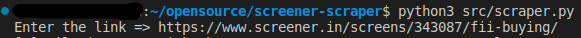
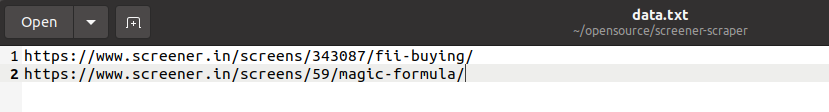

# screener-scraper
python script to scrape the screener.in website


installation 

```python

pip3 install requirements.txt

```
usage:

### When single link 

```python3 
python3 scraper.py

```
paste the link 



output shows number of valid and invalid link. Here invalid links are the one which script unable to process. Script will also print list of invalid links in the terminal. 


After fetching data, output file is stored in the format out_datatime.xlsx in same directory form where you run the script. 

### Multiple link 

process is same, but only this time make the text file with name data.txt in the same folder as you scraper script and put each link on the new line as show in the image below. After that save the file 



Now run the command 

```python3 

python3 scraper.py -f 

```

Single file will be generated and all data is put in the order in which the links are placed in the txt file. Invalid links will be skiped. 


### Tested on the system 

OS : Ubuntu 20.04

python version: 3.8.5


